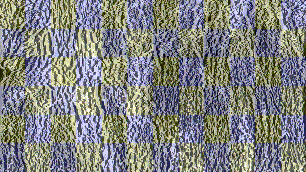

# Datamoshing

This repository contains Python scripts to perform some datamoshing effects.

For details about how this works and what it does, please see [this blog article](https://chalier.fr/blog/datamoshing).

## Contents

Script | Description
------ | -----------
[Drop h264 I-Frames](drop-h264-iframes/) | Removes every reference frames from a video, except the first one.
[Optical Flow Transfer](optical-flow-transfer/) | Transfer optical flow from one video to an image.
[Audacity Scripting](audacity-scripting/) | Frame by frame datamoshing relying on Audacity.

## Examples

Here are some videos made using those scripts (click on the thumbnails to see the videos):

Drop h264 I-Frames | Optical Flow Transfer | Audacity Scripting
------------------ | --------------------- | ------------------
 |  | 

## Demo

Here is a [web demonstration](https://chalier.fr/datamoshing/) where you may try different video sources (such as the webcam) and image sources to perform optical flow transfer.
